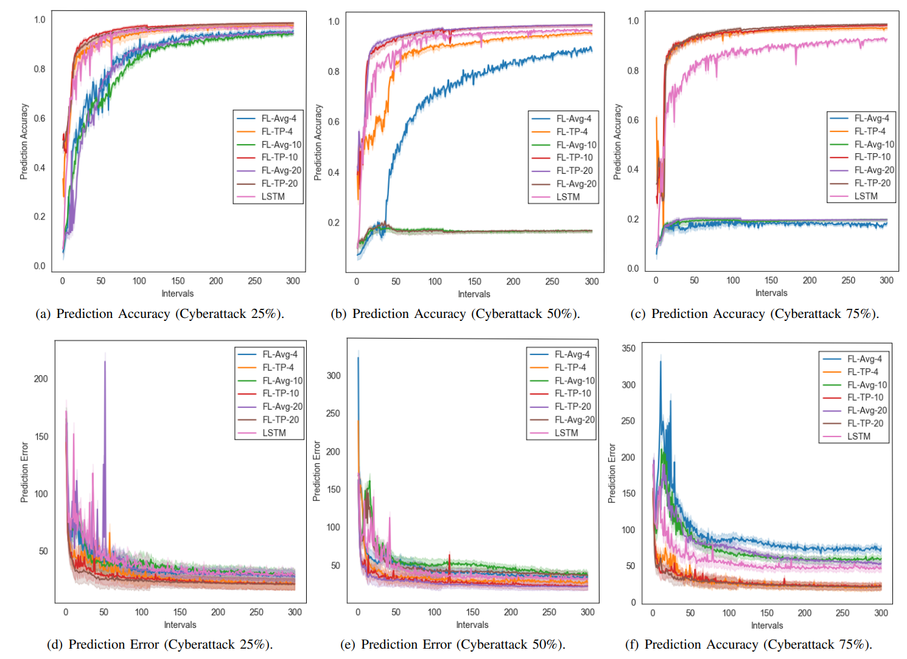

# FL-TP

**FL-TP: Federated Learning-based Vehicle Trajectory Prediction Algorithm against Cyberattacks**

**Requirments**
Install all the packages from requirments.txt

Python3
Pytorch
Torchvision

**Data**

The data set can be downloaded from the official website of VeRemi(https://veremi-dataset.github.io/), and generated in the makedata folder.

The data Sample could be seen in the url {https://github.com/CoderTylor/FL-TP/tree/main/FL-TP}

**Running the experiments**

The baseline experiment trains the model in the Fed-Avg.

To run the code:

```shell
python fltp_main.py --model=LSTM --epochs=10 --user=4/10/20
```

**Options**
The default values for various paramters parsed to the experiment are given in options.py. Details are given some of those parameters:

```shell
--gpu: Default: None (runs on CPU). Can also be set to the specific gpu id.

--epochs: Number of rounds of training.

--lr: Learning rate set to 0.01 by default.

--seed: Random Seed. Default set to 1.

--num_users:Number of users. Default is 100.

--local_ep: Number of local training epochs in each user. Default is 10.

--local_bs: Batch size of local updates in each user. Default is 10.
```


**Experiment Result**

- 

